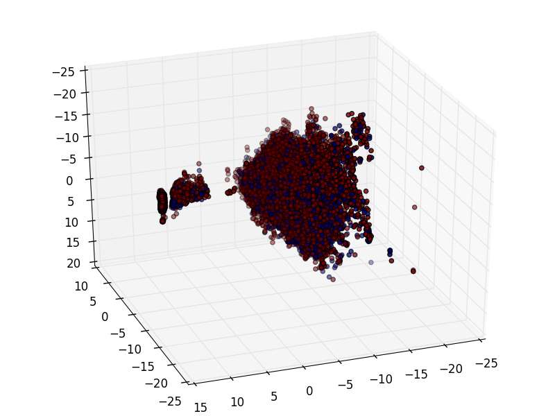

# Kaggle InsuranceClaimsCompetition
In this competition (https://www.kaggle.com/c/bnp-paribas-cardif-claims-management) we are attempting to determine whether an insurance claim should be approved or whether more information is needed before an approval can be made.We were expected to produce a softmax estimator on a scale of 0 to 1 with 0 being a claim that required more information and 1 being a claim that is ready for approval. The methods we used to create this softmax estimator included: Gradient Boosting, Neural Networks, Ensembled Neural Networks, and Random Foresets. 

##Data Visualization
Below we show the 3 principle components of the data set (around 114,000 points with 131 features each). The color of each point denotes whether the claim was accepted or required more information. 

